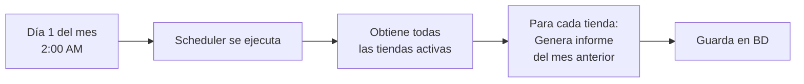
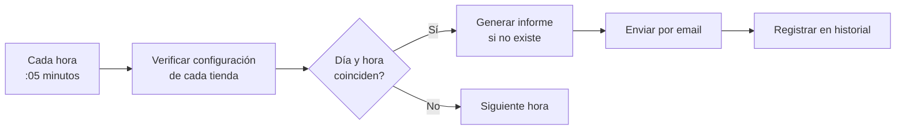
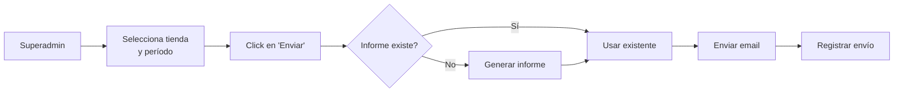

# Sistema de Informes Mensuales con IA

## 📊 Descripción

Sistema completo de generación y envío automático de informes mensuales con análisis de Inteligencia Artificial para cada tienda en Qronnect.

### Características Principales

- ✅ **Generación automática de informes mensuales** con análisis de KPIs
- ✅ **Análisis con IA (Gemini)** de rendimiento y tendencias
- ✅ **Comparativas** con mes anterior y mismo mes año anterior
- ✅ **Análisis de impacto** de promociones y campañas
- ✅ **Plan de acción** generado por IA para el próximo mes
- ✅ **Envío automático programado** por email
- ✅ **Envío manual** desde panel de Superadmin
- ✅ **Historial completo** de informes generados y enviados
- ✅ **Emails profesionales en HTML** con diseño responsive

## 🏗️ Arquitectura

```
backend/src/informes/
├── informes.module.ts          # Módulo principal con ScheduleModule
├── informes.service.ts         # Lógica de negocio (generación, análisis)
├── informes.controller.ts      # Endpoints para admin de tienda
├── informes.scheduler.ts       # Tareas cron para envíos automáticos
├── dto/
│   ├── generar-informe.dto.ts      # DTO para generar informes
│   ├── enviar-informe.dto.ts       # DTO para enviar informes
│   └── configuracion-informe.dto.ts # DTO para configuración
└── templates/
    └── (Plantillas HTML inline en el servicio)
```

## 📋 Flujo de Funcionamiento

### 1. Generación Automática Mensual



**Cron:** `0 2 1 * *` (Día 1 de cada mes a las 2:00 AM)

### 2. Envío Automático Programado



**Cron:** `5 * * * *` (Cada hora a los 5 minutos)

### 3. Envío Manual desde Superadmin



## 🔧 API Endpoints

### Endpoints de Admin de Tienda

**Base URL:** `/api/admin/informes`

| Método | Endpoint | Descripción | Auth |
|--------|----------|-------------|------|
| POST | `/generar` | Genera un informe para el período especificado | AdminAuthGuard |
| POST | `/enviar` | Envía un informe por email | AdminAuthGuard |
| GET | `/` | Lista los informes generados | AdminAuthGuard |
| GET | `/configuracion` | Obtiene configuración de envío automático | AdminAuthGuard |
| PUT | `/configuracion` | Actualiza configuración de envío automático | AdminAuthGuard |

### Endpoints de Superadmin

**Base URL:** `/superadmin/tiendas/:id/informes`

| Método | Endpoint | Descripción | Auth |
|--------|----------|-------------|------|
| GET | `/` | Lista informes de una tienda | SuperAdminGuard |
| POST | `/generar` | Genera informe para una tienda | SuperAdminGuard |
| POST | `/enviar` | Envía informe a una tienda | SuperAdminGuard |
| GET | `/configuracion` | Obtiene configuración | SuperAdminGuard |
| PUT | `/configuracion` | Actualiza configuración | SuperAdminGuard |

## 📊 Estructura del Informe

### Datos Calculados (datos_kpis)

```typescript
{
  ventasTotales: number;        // Suma de ventas del mes
  numeroTickets: number;        // Cantidad de compras
  ticketMedio: number;          // Promedio por compra
  clientesNuevos: number;       // Clientes registrados en el mes
  clientesActivos: number;      // Clientes que compraron
  puntosOtorgados: number;      // Total de puntos dados
  periodoInicio: string;        // Fecha inicio (YYYY-MM-DD)
  periodoFin: string;           // Fecha fin (YYYY-MM-DD)
}
```

### Análisis de IA (analisis_ia)

```typescript
{
  analisisGeneral: {
    summary: string;                    // Resumen ejecutivo
    highlights: string[];               // Puntos destacados
    recommendations: Array<{
      texto: string;
      accionable: boolean;
      tipo_accion?: 'campana_email' | 'promocion' | 'ambas' | 'ninguna';
      contexto_accion?: string;
    }>;
  };
  impactoPromociones: {
    resumen: string;
    impacto: 'positivo' | 'neutral' | 'negativo';
    recomendaciones?: string[];
  };
  impactoCampanas: {
    resumen: string;
    impacto: 'positivo' | 'neutral' | 'negativo';
    campanas?: Array<{
      nombre: string;
      destinatarios: number;
      fecha_envio: string;
    }>;
  };
}
```

### Comparativa (comparativa_anterior)

```typescript
{
  mesAnterior: KPIs;                  // KPIs del mes anterior
  mismoMesAnioAnterior: KPIs;         // KPIs del mismo mes año pasado
  variacionMesAnterior: {
    ventasTotales: number;
    numeroTickets: number;
    ticketMedio: number;
    clientesNuevos: number;
    clientesActivos: number;
  };
  variacionAnioAnterior: { ... };
}
```

### Plan Siguiente Mes (plan_siguiente_mes)

```typescript
{
  objetivos: Array<{
    objetivo: string;
    metrica: string;
    valor_objetivo: number;
  }>;
  acciones: Array<{
    accion: string;
    prioridad: 'alta' | 'media' | 'baja';
    implementable_sistema: boolean;
    tipo: 'campana_email' | 'promocion' | 'mejora_operativa' | 'otro';
  }>;
  kpis_monitorear: string[];
}
```

## 🎨 Email Template

El sistema genera emails HTML profesionales con:

- ✅ Diseño responsive (mobile-first)
- ✅ Branding con gradientes
- ✅ KPIs destacados en tarjetas visuales
- ✅ Análisis de IA formateado
- ✅ Highlights y recomendaciones con iconos
- ✅ Comparativas con porcentajes de cambio
- ✅ Resumen de promociones y campañas
- ✅ Plan de acción con prioridades coloreadas

### Vista previa del email

```
┌─────────────────────────────────────────┐
│     📊 Informe Mensual                  │
│     Mi Tienda - Noviembre 2025          │
├─────────────────────────────────────────┤
│                                         │
│  📈 Resumen de Resultados               │
│                                         │
│  ┌─────────┐  ┌─────────┐              │
│  │ €5,230  │  │   145   │              │
│  │ Ventas  │  │ Tickets │              │
│  └─────────┘  └─────────┘              │
│                                         │
│  🤖 Análisis con IA                     │
│  "Tu negocio tuvo un rendimiento..."    │
│                                         │
│  ⭐ Puntos Destacados                   │
│  • Incremento del 15% en ventas         │
│  • Mayor ticket medio                   │
│                                         │
│  💡 Recomendaciones                     │
│  • Crear campaña de reactivación        │
│  • Implementar promoción 2x1            │
│                                         │
│  🎯 Plan para el Próximo Mes            │
│  Objetivos:                             │
│  • Aumentar ventas a €6,000             │
│  Acciones [ALTA]:                       │
│  • Enviar campaña de Black Friday       │
│                                         │
└─────────────────────────────────────────┘
```

## ⚙️ Configuración

### Variables de Entorno Necesarias

```env
# IA (Gemini)
GEMINI_API_KEY=tu_api_key_de_gemini

# Email (Resend)
RESEND_API_KEY=re_tu_api_key
RESEND_FROM_EMAIL=noreply@tudominio.com
```

### Configuración por Tienda

Cada tienda puede configurar:

| Campo | Tipo | Descripción | Default |
|-------|------|-------------|---------|
| `automatico` | boolean | Activar envío automático | `false` |
| `email_destino` | string | Email principal | `null` |
| `emails_cc` | string[] | Emails en copia | `[]` |
| `dia_envio` | number | Día del mes (1-28) | `1` |
| `hora_envio` | number | Hora del día (0-23) | `9` |
| `timezone` | string | Zona horaria | `'Europe/Madrid'` |
| `incluir_pdf` | boolean | Adjuntar PDF | `true` |
| `incluir_analisis_ia` | boolean | Incluir análisis IA | `true` |
| `incluir_comparativa` | boolean | Incluir comparativa | `true` |
| `incluir_plan_accion` | boolean | Incluir plan de acción | `true` |

## 🧪 Testing

### 1. Generar informe manual

```bash
curl -X POST http://localhost:3001/api/admin/informes/generar \
  -H "Authorization: Bearer [TOKEN_ADMIN]" \
  -H "Content-Type: application/json" \
  -d '{
    "periodo_mes": 11,
    "periodo_anio": 2025,
    "formato": "json"
  }'
```

### 2. Enviar informe por email

```bash
curl -X POST http://localhost:3001/api/admin/informes/enviar \
  -H "Authorization: Bearer [TOKEN_ADMIN]" \
  -H "Content-Type: application/json" \
  -d '{
    "periodo_mes": 11,
    "periodo_anio": 2025,
    "email_destino": "admin@tienda.com"
  }'
```

### 3. Configurar envío automático

```bash
curl -X PUT http://localhost:3001/api/admin/informes/configuracion \
  -H "Authorization: Bearer [TOKEN_ADMIN]" \
  -H "Content-Type: application/json" \
  -d '{
    "automatico": true,
    "email_destino": "admin@tienda.com",
    "dia_envio": 1,
    "hora_envio": 9,
    "incluir_analisis_ia": true,
    "incluir_comparativa": true,
    "incluir_plan_accion": true
  }'
```

### 4. Verificar scheduler (logs)

```bash
# Logs del backend
npm run start:dev

# Buscar logs del scheduler:
# [InformesScheduler] Verificando envíos automáticos...
# [InformesScheduler] Generando informes mensuales...
```

## 📝 Casos de Uso

### Caso 1: Envío Automático Mensual

**Escenario:** Cafetería quiere recibir informe el día 2 de cada mes a las 10:00 AM

**Configuración:**
```json
{
  "automatico": true,
  "email_destino": "admin@cafeteria.com",
  "dia_envio": 2,
  "hora_envio": 10,
  "timezone": "Europe/Madrid"
}
```

**Resultado:**
- El día 2 a las 10:05 AM, el scheduler detecta la configuración
- Genera informe del mes anterior si no existe
- Envía email a admin@cafeteria.com
- Registra en historial como "automático"

### Caso 2: Envío Manual desde Superadmin

**Escenario:** Superadmin necesita enviar informe de octubre 2025 a una tienda

**Pasos:**
1. Acceder a `/superadmin/informes`
2. Seleccionar tienda
3. Ir a tab "Envío Manual"
4. Seleccionar Octubre 2025
5. Ingresar email destino
6. Click en "Generar y Enviar"

**Resultado:**
- Sistema genera informe de octubre si no existe
- Envía email al destino especificado
- Registra en historial como "manual" con ID de superadmin

### Caso 3: Consultar Historial de Informes

**Escenario:** Admin de tienda quiere ver informes pasados

**Pasos:**
1. GET `/api/admin/informes?limite=12`

**Respuesta:**
```json
[
  {
    "id": "uuid",
    "periodo_mes": 11,
    "periodo_anio": 2025,
    "estado": "enviado",
    "fecha_generacion": "2025-12-01T02:00:00Z",
    "fecha_envio": "2025-12-02T10:05:00Z",
    "enviado_a": "admin@tienda.com",
    "datos_kpis": { ... },
    "analisis_ia": { ... }
  },
  ...
]
```

## 🐛 Troubleshooting

### Problema: Los informes no se envían automáticamente

**Solución:**
1. Verificar que el scheduler esté activo en logs:
   ```
   [InformesScheduler] Verificando envíos automáticos...
   ```
2. Verificar configuración en BD:
   ```sql
   SELECT * FROM configuracion_informes WHERE automatico = true;
   ```
3. Verificar timezone y hora actual del servidor
4. Verificar que `RESEND_API_KEY` esté configurado

### Problema: Error al generar análisis con IA

**Solución:**
1. Verificar que `GEMINI_API_KEY` esté configurado
2. Verificar logs del backend:
   ```
   [GEMINI KPI ANALYSIS] Error: ...
   ```
3. Verificar que haya datos suficientes en el mes
4. Verificar límites de uso de Gemini API

### Problema: Emails no llegan

**Solución:**
1. Verificar `RESEND_FROM_EMAIL` esté verificado en Resend
2. Verificar logs de Resend en el dashboard
3. Verificar que el email destino sea válido
4. Revisar carpeta de spam

## 🚀 Mejoras Futuras

- [ ] Generación de PDF con pdfkit (actualmente solo HTML email)
- [ ] Soporte para múltiples idiomas
- [ ] Gráficos visuales en el informe (Chart.js)
- [ ] Exportar informes a Excel/CSV
- [ ] Comparativas personalizadas (últimos 3 meses, trimestre, etc.)
- [ ] Webhooks para notificar cuando se genera un informe
- [ ] Plantillas de email personalizables por tienda
- [ ] Predicciones con IA para el próximo trimestre

## 📚 Referencias

- [NestJS Scheduler](https://docs.nestjs.com/techniques/task-scheduling)
- [Gemini AI API](https://ai.google.dev/)
- [Resend Email API](https://resend.com/docs)
- [Cron Expression Generator](https://crontab.guru/)

## 📄 Licencia

Parte del proyecto Qronnect - Sistema de Fidelización SaaS
